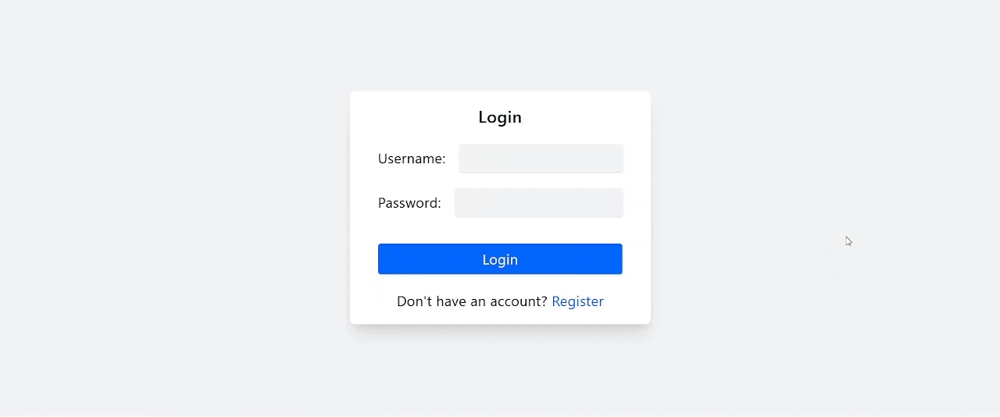
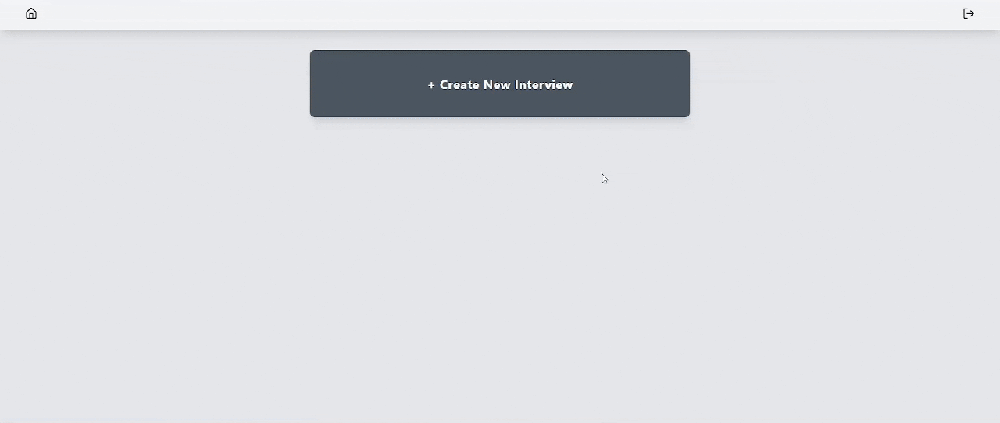
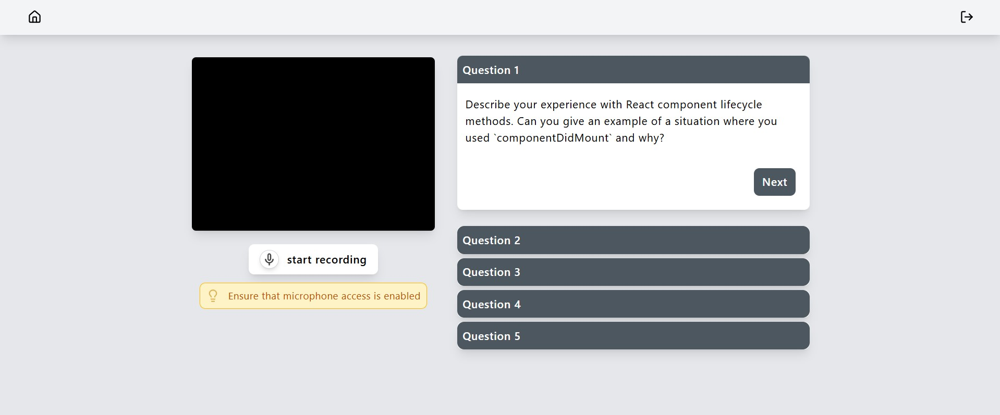
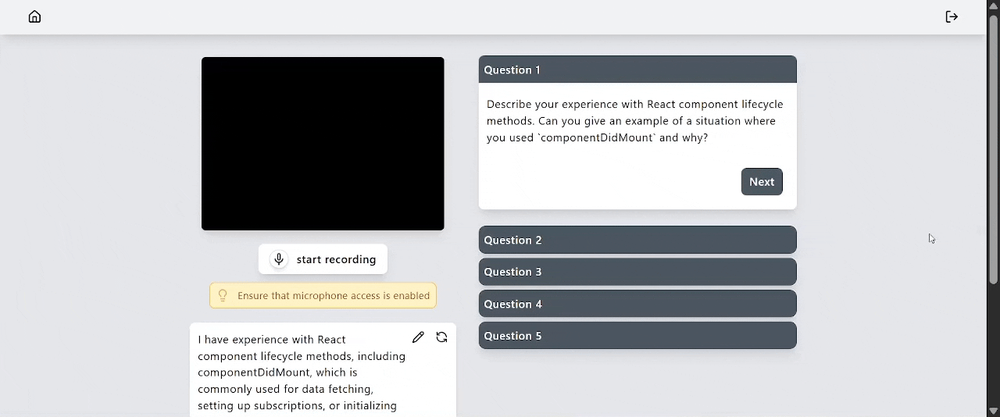
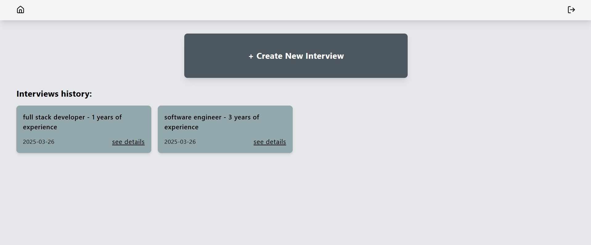

# AI Interview Mockup

## Overview
AI Interview Mockup is a website that helps users prepare for job interviews. Users can input job details, and the AI will generate relevant interview questions. They can record their responses and receive feedback for improvement. Built with React, Django REST Framework (DRF), and Tailwind CSS, this project aims to provide a realistic interview experience to help users get ready with confidence.

## Features
- Question Generation - The AI generates tailored interview questions based on the job position, description, and years of experience.
- Answer Recording - Users can record their answers using speech-to-text technology, converting spoken responses into written text.
- AI Feedback - After each question, the AI provides feedback based on the user’s responses. At the end of the session, a summary of the feedback is displayed for the user to review and improve their performance. 

## Tech Stack
- **Frontend:** React, HTML, CSS (Tailwind CSS), Axios, Vite 
- **Backend:** Django REST Framework (DRF)
- **API Integration:** Gemini API
- **Speech-to-Text:** react-hook-speech-to-text
- **Other Tools:** Git, GitHub 

## Feature Previews
- *Register and Login.*

- *Entering job details.*

- *The interview begins with the first question. The black box represents the camera (if enabled).*

- *Start recording the answer.*

- *Reset answer and record again (if needed).*

- *Navigate to next question.*

- *End the interview and receive feedback.*

- *View feedback from previous interviews on the home page.*

